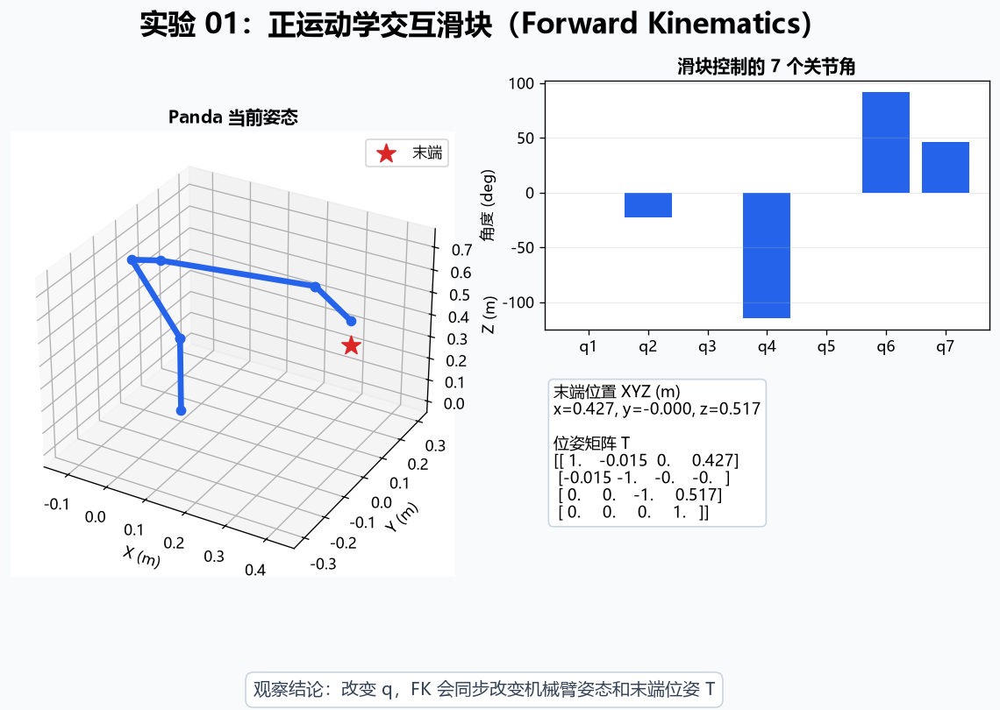
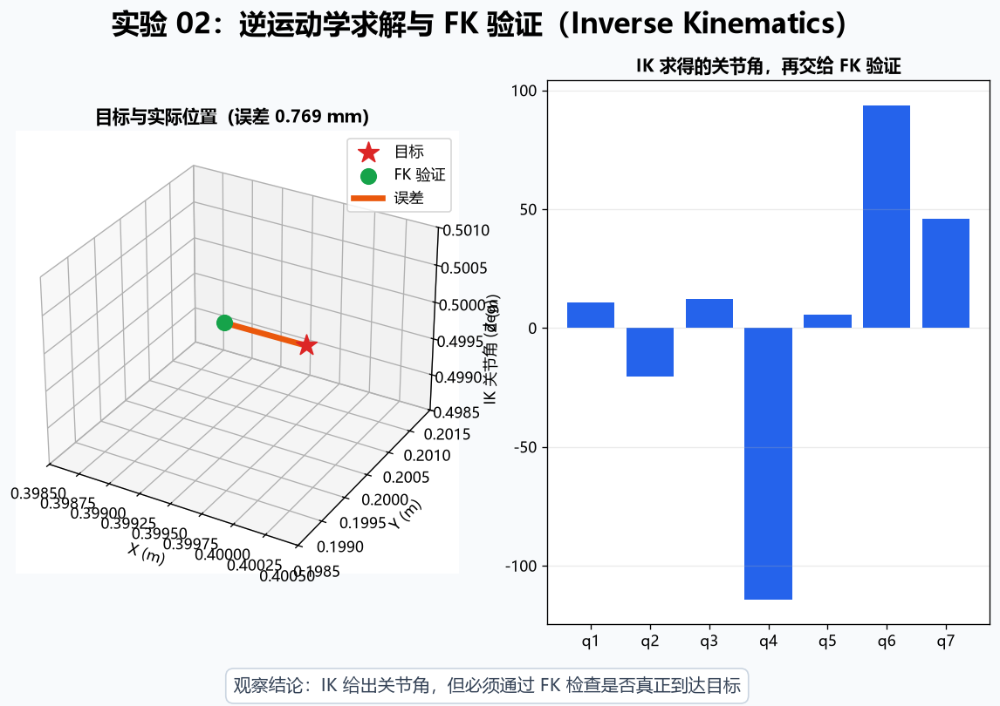
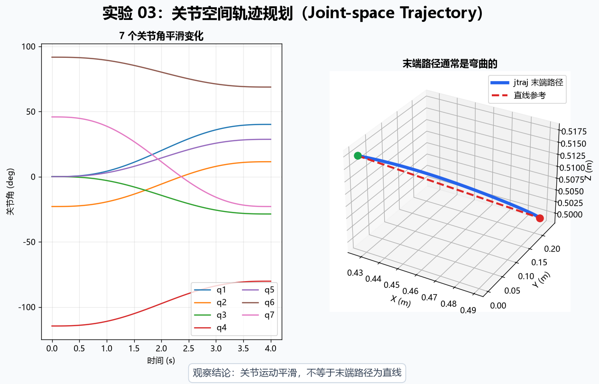
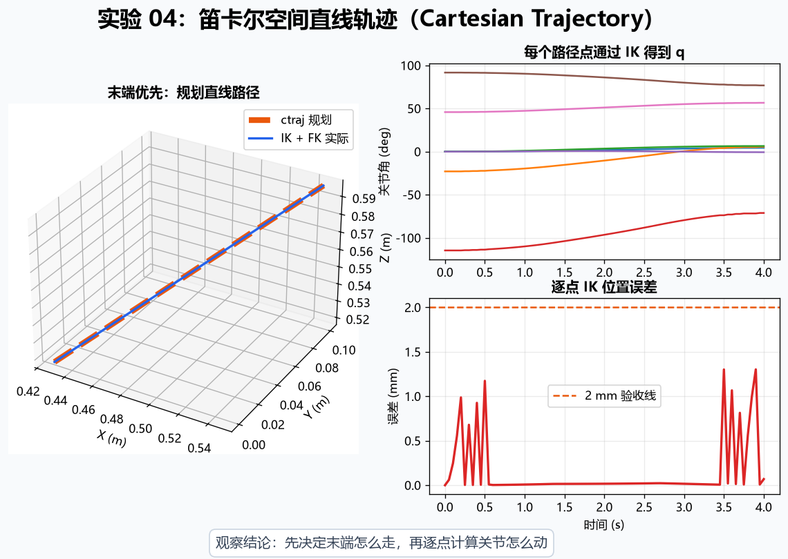
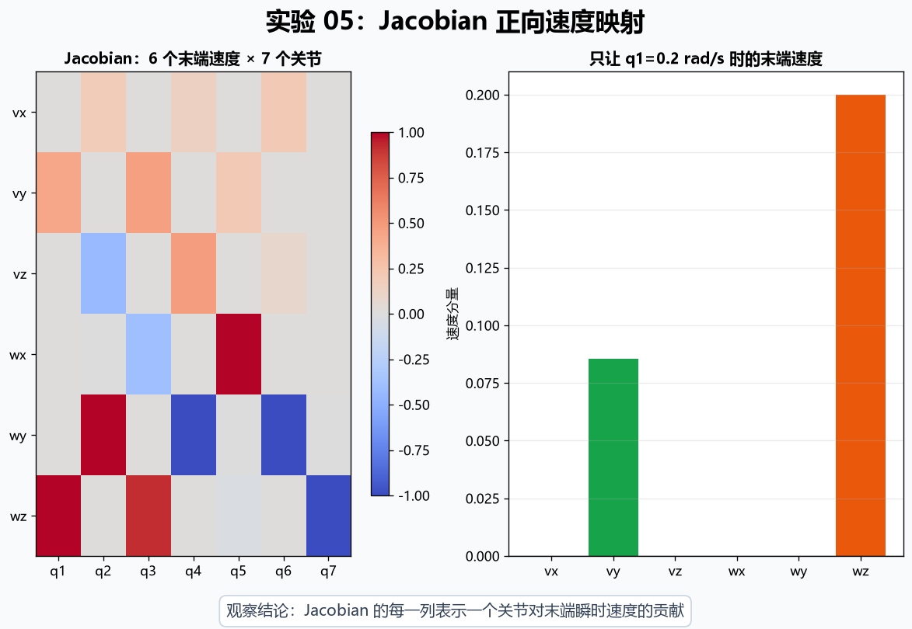
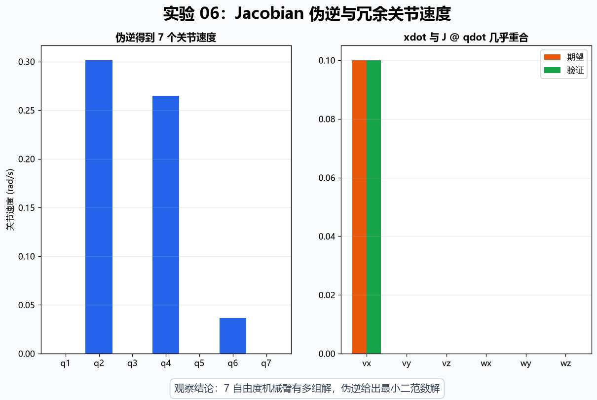
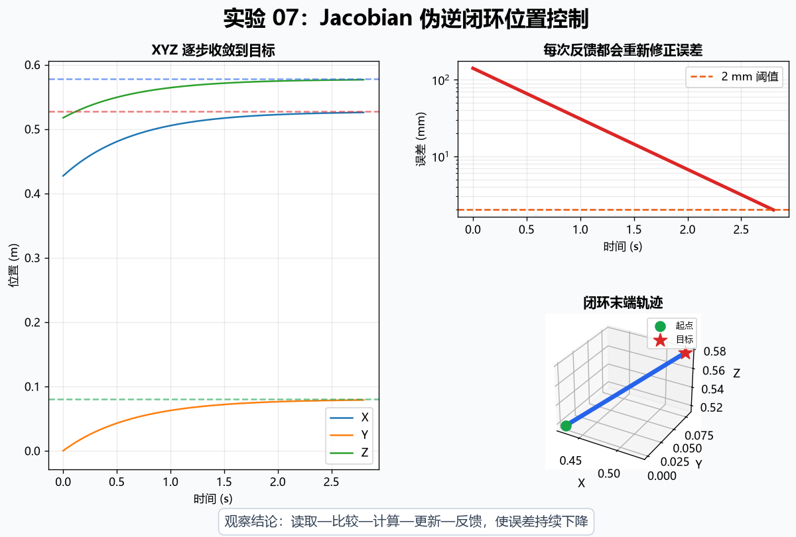
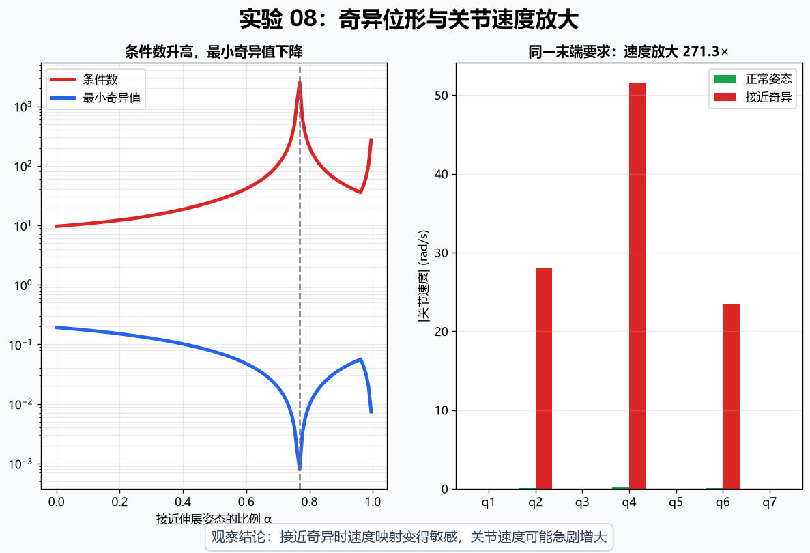

# Robot Kinematics Playground

一个面向初学者的机械臂运动学实验场。项目使用 Franka Emika Panda 的 DH 模型，通过 8 个可以独立运行的 Python 示例，把抽象公式变成可观察的数字、曲线和动画。

项目只使用 Matplotlib / PyPlot 绘制“骨架式”机械臂，不加载 Swift 的 Collada/DAE 网格，因此更适合 Windows 桌面环境。

## 适合人群

- 第一次接触机械臂、机器人学或 Robotics Toolbox for Python 的学习者
- 已经会运行基础 Python，希望直观理解运动学概念的学生
- 需要一套可修改、可演示的中文教学代码的教师和助教

你不需要提前学过矩阵推导，但建议了解 NumPy 数组和最基本的线性代数。

## 学习目标

完成本项目后，你应该能够：

1. 区分关节空间（Joint Space）与笛卡尔空间（Cartesian Space）。
2. 理解正运动学 Forward Kinematics (FK) 与逆运动学 Inverse Kinematics (IK) 的输入输出。
3. 解释关节空间轨迹 `jtraj` 和笛卡尔轨迹 `ctraj` 的区别。
4. 使用 Jacobian 在关节速度与末端速度之间转换。
5. 理解 7 自由度机械臂为什么需要 Jacobian 伪逆（Pseudo-inverse）。
6. 看懂最基础的闭环位置控制流程。
7. 直观认识奇异位形（Singularity）及其带来的数值问题。

## 核心概念关系

```text
关节角 q
   ↓ Forward Kinematics (FK)
末端位姿 T

末端位姿 T
   ↓ Inverse Kinematics (IK)
关节角 q

关节速度 qdot
   ↓ Jacobian J
末端速度 xdot

末端速度 xdot
   ↓ Jacobian pseudo-inverse J⁺
关节速度 qdot
```

这里的末端位姿 `T` 同时包含位置和姿态；末端速度 `xdot` 包含 3 个线速度分量和 3 个角速度分量。

## 环境要求

- Windows 10/11（其他桌面系统通常也可运行）
- Python 3.12
- 可显示 Matplotlib 图形窗口的桌面环境

主要依赖：

- `roboticstoolbox-python`
- `spatialmath-python`
- `numpy`
- `matplotlib`

## Windows 安装步骤

打开 PowerShell，进入项目目录，然后执行：

```powershell
python -m venv .venv
Set-ExecutionPolicy -Scope Process -ExecutionPolicy Bypass
.\.venv\Scripts\Activate.ps1
python -m pip install --upgrade pip
pip install -r requirements.txt
```

如果电脑上有多个 Python 版本，请先运行 `python --version`，确认显示的是 Python 3.12。

本项目没有安装 Swift 可视化扩展，也不需要浏览器加载机器人网格。第一次安装 Robotics Toolbox 可能需要一些时间。

## 如何运行

保持虚拟环境已激活，每次只运行一个示例：

```powershell
python 01_fk_slider.py
python 02_inverse_kinematics.py
python 03_joint_trajectory.py
python 04_cartesian_trajectory.py
python 05_jacobian_velocity.py
python 06_jacobian_inverse.py
python 07_closed_loop_control.py
python 08_singularity.py
```

图形示例会打开一个或多个 Matplotlib 窗口。先查看图形和终端输出，关闭当前窗口后再运行下一章。

## 推荐学习顺序

| 章节 | 核心主题 | 学完应该理解什么 |
| --- | --- | --- |
| 01 | 正运动学 FK | 改变关节角会如何改变末端位置；`q → FK → T` |
| 02 | 逆运动学 IK | 已知目标位置如何反求关节角，以及为什么要用 FK 验证 |
| 03 | 关节空间轨迹 | `jtraj` 让关节平滑变化，但末端路径不保证为直线 |
| 04 | 笛卡尔空间轨迹 | `ctraj` 先规划末端路径，再逐点通过 IK 求关节角 |
| 05 | Jacobian 正向映射 | 如何用 `xdot = J @ qdot` 计算末端瞬时速度 |
| 06 | Jacobian 伪逆 | 如何用 `qdot = J⁺ @ xdot` 反求冗余机械臂的关节速度 |
| 07 | 闭环位置控制 | “读取—比较—计算—更新—反馈”如何让末端逼近目标 |
| 08 | 奇异位形 | 为什么接近奇异时条件数变差、关节速度可能急剧增大 |

## `jtraj` 与 `ctraj`

```text
jtraj:
先规划关节角
-> 关节运动平滑
-> 末端路径不一定直

ctraj:
先规划末端路径
-> 每个路径点做 IK
-> 末端可以走直线
```

两者不是谁“更好”，而是规划对象不同。关节空间轨迹通常更直接；当末端必须沿指定路径移动时，笛卡尔空间轨迹更符合任务需求。

## 八个实验教学卡片

每个脚本启动时都会在终端、机械臂窗口和数据图中显示同一个实验标题。建议按“问题 → 公式 → 操作 → 观察 → 结论”的顺序完成实验，而不是只看最终图片。

### 实验 01：正运动学交互滑块（Forward Kinematics）



- **问题：** 7 个关节角改变时，末端位置和姿态怎样变化？
- **公式：** `q → FK → T`，即 `T = robot.fkine(q)`。
- **操作：** 拖动 q1～q7 滑块，同时查看机械臂、XYZ、角度列表和位姿矩阵。
- **观察：** 单个关节变化可能同时影响末端多个坐标和朝向。
- **结论：** FK 已知关节角，计算唯一的末端位姿；内部使用弧度，界面显示角度。

### 实验 02：逆运动学求解与 FK 验证（Inverse Kinematics）



- **问题：** 已知目标位置，怎样求出一组可以到达它的关节角？
- **公式：** `T_target → IK → q_solution → FK → T_actual`。
- **操作：** 运行数值 IK，检查 `success`，再比较红色目标点与绿色 FK 验证点。
- **观察：** 目标点和实际点应几乎重合，橙色误差线应很短。
- **结论：** IK 可能有多解或失败，因此求解后必须用 FK 验证。

### 实验 03：关节空间轨迹规划（Joint-space Trajectory）



- **问题：** 关节角都平滑变化时，末端会不会自动沿直线运动？
- **公式：** `q(t) = jtraj(q_start, q_target, t)`，再由 `T(t) = FK(q(t))` 得到末端路径。
- **操作：** 先看 7 条关节角曲线，再比较蓝色实际末端路径与红色直线参考。
- **观察：** 关节曲线很平滑，但两条空间路径通常不重合。
- **结论：** `jtraj` 规划的是关节空间，不保证末端路径为直线。

### 实验 04：笛卡尔空间直线轨迹（Cartesian Trajectory）



- **问题：** 怎样让末端优先沿指定直线移动？
- **公式：** `T_path = ctraj(T_start, T_target, N)`，随后逐点执行 `q[k] = IK(T_path[k])`。
- **操作：** 比较规划路径与 IK+FK 实际路径，同时查看关节运动和逐点误差。
- **观察：** 两条末端路径几乎重合；关节角由每个轨迹点的 IK 自动决定。
- **结论：** 笛卡尔规划先决定末端怎么走，再计算关节怎么动。

### 实验 05：Jacobian 正向速度映射



- **问题：** 某个关节正在转动时，末端瞬时速度是多少？
- **公式：** `xdot = J(q) @ qdot`。
- **操作：** 只给 q1 设置 `0.2 rad/s`，阅读 6×7 Jacobian 热力图和末端速度柱状图。
- **观察：** 一个关节速度可以同时产生末端线速度和角速度。
- **结论：** Jacobian 的每一列表示对应关节单位速度对末端速度的贡献。

### 实验 06：Jacobian 伪逆与冗余关节速度



- **问题：** 已知期望末端速度，7 个关节应该分别转多快？
- **公式：** `qdot = pinv(J) @ xdot`，并用 `xdot_check = J @ qdot` 验证。
- **操作：** 比较 7 个关节速度柱状图，以及期望与验证末端速度。
- **观察：** 多个关节共同产生沿 +X 的末端速度，两组验证柱几乎重合。
- **结论：** Panda 是冗余机械臂；伪逆从多组可能解中给出最小二范数解。

### 实验 07：Jacobian 伪逆闭环位置控制



- **问题：** 怎样利用实时位置误差，让末端不断修正并到达目标？
- **公式：** `error = p_target - p`，`v = K·error`，`qdot = pinv(J) @ xdot`。
- **操作：** 观察 XYZ、对数误差曲线和末端三维轨迹，并留意速度限制和停止阈值。
- **观察：** 每轮反馈后误差继续下降，最终进入 2 mm 目标区。
- **结论：** 闭环控制不断重复“读取 → 比较 → 计算 → 更新 → 反馈”。

### 实验 08：奇异位形与关节速度放大



- **问题：** 为什么机械臂接近某些姿态时，关节速度会突然变得很大？
- **公式：** `condition = σ_max / σ_min`，`qdot = pinv(J) @ xdot`。
- **操作：** 比较条件数、最小奇异值以及正常/近奇异姿态所需关节速度。
- **观察：** 最小奇异值下降时条件数升高，同一末端速度要求被显著放大。
- **结论：** 接近奇异位形时速度映射变得敏感，实际控制通常需要阻尼或速度限制。

## 常见问题

**图形窗口没有出现？**  请确认是在本地桌面终端运行，而不是无图形界面的服务器；也可以检查 Matplotlib 是否能独立显示窗口。

**IK 提示失败？**  数值 IK 对目标、初值和版本有一定敏感性。示例已选用较容易收敛的目标；如修改目标，请确保它在机械臂可达范围内。

**中文字体出现方框？**  代码会尝试使用 Windows 常见中文字体。若系统没有这些字体，图形仍可运行，但标题中的中文可能无法正确显示。

## 进一步实验

- 修改目标位置，观察哪些目标不可达。
- 增加或减少轨迹采样点，比较动画平滑程度。
- 修改闭环增益 `K`、时间步长 `dt` 和速度上限。
- 在接近奇异位形时尝试阻尼最小二乘（Damped Least Squares），并与普通伪逆比较。

## License

本项目使用 [MIT License](LICENSE)。欢迎用于学习、教学和二次开发。
